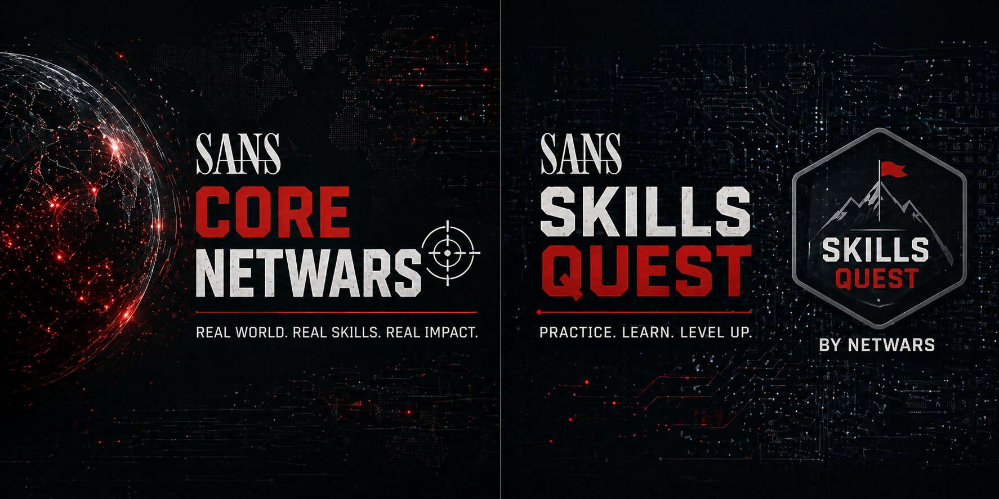

# ***🌘 SANS Core NetWars Tournament & Skills Quest by NetWars***

	<em>Review, strategy, and real-world approach to SANS NetWars Cyber Range, along with insights into Skills Quest by NetWars as a training platform.</em>

	

> This repository was created with the goal of capturing, in a single place, a personal and up-to-date review of both the [SANS Core NetWars competitions](https://www.sans.org/cyber-ranges) ([Cyber Range](https://www.sans.org/cyber-ranges), [Tournament](https://www.sans.org/media/netwars/brochure-netwars.pdf)) and the [Skills Quest by NetWars platform](https://www.sans.org/cyber-ranges/skills-quest).

---
---
---

## ***📑 Table of Contents***

<ul>
	<li><a href="#introduction">Introduction</a></li>
	<li><a href="#what-is-netwars">What is SANS NetWars</a></li>
	<li><a href="#platform-mechanics">Platform Mechanics</a></li>
	<li><a href="#skills-quest">Skills Quest by NetWars</a></li>
	<li><a href="#approach">My Approach Before the CTF</a></li>
	<li><a href="#ctf-experience">CTF Experience (Day 4 & 5)</a>

	
📂

	<ul>
		<li><a href="#challenge-types">Challenge Types</a></li>
		<li><a href="#day4">Day 4</a></li>
		<li><a href="#day5">Day 5</a></li>
	</ul>

	</li>
	<li><a href="#scoring">Scoring & Competition Dynamics</a></li>
	<li><a href="#strategy">Strategy & Lessons Learned</a></li>
	<li><a href="#experience">Overall Experience</a></li>
	<li><a href="#improvements">Things to Improve</a></li>
	<li><a href="#why-different">Why This CTF Feels Different</a></li>
	<li><a href="#final-result">Final Result</a></li>
	<li><a href="#recommendations">Recommendations</a></li>
</ul>

---
---
---

## ***🧭 Introduction***

Around April 2026, in the middle of submitting CFPs to different conferences and working on vulnerability research and exploit development, I was given the opportunity to take a SANS course, specifically [SEC-556: IoT Penetration Testing](https://www.sans.org/cyber-security-courses/iot-penetration-testing).

I've already covered that experience in a separate [repository](https://github.com/TheMalwareGuardian/SANS-SEC556-IoT-Penetration-Testing), so I won't go into detail here. But what matters for this context is what comes after the course.

When you have access to a SANS training, whether it's a three-day or a five-day course, you're typically invited to participate in a NetWars "CTF", which takes place during what would normally be considered "Day 4 and Day 5".

This CTF is not just an extra activity, it's a completely different experience.

At first, I tried to find detailed information about it: how it works, what kind of challenges to expect, how the platform behaves, what the best approach is... but there's actually very little out there. You'll find people mentioning that they've done it, but not many going into the level of detail I was looking for.

So I decided to approach it properly.

This repository is basically a breakdown of that experience:

- How I approached it.
- How the platform works.
- What worked and what didn't.
- What kind of challenges you'll face.
- And how you can prepare if you want to get the most out of it.

Alongside that, I'll also cover Skills Quest by NetWars, which is the training platform built around the same environment, and in my opinion, one of the key elements if you actually want to perform well in the CTF.

---
---
---

## ***🌐 What is SANS NetWars***

SANS refers to their CTF environments as "NetWars", and they've built an entire ecosystem around it.

At a high level, [NetWars](https://www.sans.org/cyber-ranges#netwars) is a multidisciplinary CTF platform, designed to simulate real-world scenarios across different areas of cybersecurity.

There isn't just one type of NetWars.

Instead, there are multiple, each focused on a different domain:

- **Core NetWars** → The most comprehensive and multidisciplinary environment, covering a wide range of areas such as web exploitation, forensics, reverse engineering, OSINT, and more.
- **Cyber Defense NetWars** → Focused on defending against real-world attack scenarios, including brute-force attacks, intrusion detection, and ransomware campaigns.
- **DFIR NetWars** → Centered around digital forensics, incident response, threat hunting, and malware analysis, from low-level artifacts to high-level behavioral analysis.
- **GRID NetWars** → Oriented towards power systems and electrical infrastructure, including generation, distribution, and related technologies.
- **Healthcare NetWars** → Focused on medical environments, including device security, web application assessments, and ransomware response in healthcare systems.
- **ICS NetWars** → Built around industrial control systems and factory environments, exposing players to the challenges of securing physical processes and manufacturing components.

The one I participated in was Core NetWars (Europe April 2026 edition), which is the most general and, in my opinion, one of the most interesting formats.

What makes it different from many traditional CTFs is not just the variety of challenges, but the platform itself.

This isn't a simple list of challenges with flags. Instead, it's a fully built environment where:

- You attack live services.
- You interact with virtual machines.
- You analyze real data and artifacts.
- You download and investigate samples.
- You move across completely different types of challenges in a very fluid way.

It feels much closer to a hands-on cyber range than a classic CTF. And that's exactly what makes it so engaging.

---
---
---

## ***⚙️ Platform Mechanics***

There are a few practical details about the platform that are worth knowing before you start.

For example, the very first "challenge" is simply accessing the environment itself. You're given credentials and expected to launch and connect to the virtual machines. There's no trick here, it's just a way to get familiar with the setup.

You're also provided with:

- A Slack channel for communication and support.
- A Zoom session where the platform and rules are explained.
- A browser-based access to machines (Windows and Linux).

These small details don't define the competition, but they do affect how smoothly your experience starts.

---
---
---

## ***🧪 Skills Quest by NetWars***

Before even getting into the CTF itself, there's one piece that, in my opinion, completely changes the experience:

**[Skills Quest by NetWars](https://www.sans.org/cyber-ranges/skills-quest)**

This is essentially the training platform built on top of the same environment used in NetWars.

Instead of being a time-limited competition, Skills Quest gives you continuous access to a large set of challenges that follow the same structure and philosophy as the CTF.

So rather than jumping straight into a six-hour competition, you can:

- Get familiar with the platform.
- Practice different types of scenarios.
- Understand how challenges are structured.
- Experiment with your own tools and workflow.

And most importantly:

> You remove the "learning phase" from the actual CTF.

Because when the competition starts, you don't want to be figuring things out. You want to be solving.

From a practical perspective, Skills Quest works like a progression-based platform, where:

- Challenges vary in difficulty.
- You can move at your own pace.
- Different disciplines are mixed together.
- And you can revisit things as needed.

It's not just a training ground, it's a way to build momentum before the CTF.

And honestly, after using it, I would say this:

> If you spend some time on Skills Quest before your first NetWars, you'll go in with a clear advantage.

---
---
---

## ***🎯 My Approach Before the CTF***

Before the CTF even started, I knew one thing for sure:

> Six hours is not enough if you go in blind.

You get two sessions of three hours. That's all the time you have to navigate the platform, understand the challenges, and extract as many flags as possible.

So my approach was very simple:

> Prepare before the competition, not during it.

That's why I purchased access to Skills Quest, specifically the six-month subscription (~$500).

The goal wasn't to complete everything, that would take too long, but to get enough exposure to:

- Understand the platform.
- Build a working workflow.
- Recognize challenge patterns.

During the days leading up to the CTF, mostly the weekend before and some time during the course itself, I worked through a portion of the challenges.

In total, I completed roughly ~20% of the platform.

That might not sound like much, but it's more than enough to get comfortable with the environment. And that practice translates directly into performance.

Because once the CTF starts:

- You already know how to move.
- You already understand the challenge logic.
- You don't waste time figuring out the basics.

You just start solving.

And that's exactly what you need in a time-limited environment like this.

In my case, this preparation made a huge difference.

Since the SANS course itself didn't cost me anything, investing in Skills Quest was absolutely worth it. Not just for the learning, but because it gave me a clear advantage when the competition started.

---
---
---

## ***⚔️ CTF Experience (Day 4 & 5)***

Now that the context is clear, let's get into the actual CTF experience.

Instead of jumping straight into what I did, I think it's more useful to first explain what you'll actually face, because that defines how you should approach it.

---

### ***🧠 Challenge Types***

Core NetWars is a multidisciplinary environment, and that's something you notice immediately.

You're not dealing with a single type of challenge. Instead, you're constantly switching between completely different scenarios.

Here are the main types of challenges I encountered:

#### ***💻 Virtual Machine-Based Challenges***

You're given access (typically through a browser-based interface like Guacamole) to:

- A Windows machine.
- A Linux machine.

Inside these environments, you'll find tasks that require you to:

- Analyze files and artifacts.
- Investigate system activity.
- Extract specific information.
- Identify persistence mechanisms.

These feel very close to real-world forensic or post-exploitation scenarios.

#### ***📦 Download-and-Analyze Challenges***

Some challenges require you to download files and work on them locally.

This includes things like:

- PCAP analysis.
- Binary inspection.
- Malware analysis.

These are usually much faster to iterate on, since you can use your own setup and tools.

#### ***🌐 Web-Based Challenges***

You're given access to a web application or exposed service.

Typical tasks involve:

- Exploiting vulnerabilities.
- Accessing restricted areas.
- Attacking login mechanisms.
- Extracting flags from the application.

This is where web pentesting skills come into play.

#### ***🖥️ Console / Shell Challenges***

In these scenarios, you're given access to a terminal or limited shell.

You'll need to:

- Enumerate the system.
- Escalate privileges.
- Locate flags.

These require quick thinking and solid command-line skills.

#### ***⚠️ Multi-Step Interactive Challenges***

These are a bit different.

Instead of directly finding a flag, you go through a sequence of steps:

- You execute a command.
- You get a question.
- You answer it.
- And move to the next step.

This continues until you reach the final flag.

They're interesting, but they can be unstable if the connection drops, and progress is not always saved.

---

### ***🧩 Day 4***

Day 4 is your first real contact with the competition.

Even if you've practiced on Skills Quest, this is where things become real: time-limited, competitive, and with other participants solving the same challenges.

My approach was very straightforward, and honestly, not the best.

I started from the beginning and focused on the easiest challenges.

This included:

- Simple investigation tasks.
- Intro-level VM-based challenges.
- Basic Linux/Windows commands.

And I think most participants did the same.

The platform is designed with a large number of challenges, and they're structured in a way that gradually increases difficulty. So it feels natural to start from the beginning.

We connected to the machines, explored the environment, analyzed files, and worked through those initial tasks.

At the end of Day 4, the results reflected that:

- The top participants had relatively similar scores.
- The differences weren't huge.
- Everyone had followed a similar path.

In my case:

- I finished the day in third place.
- With roughly ~300 points.

And the gap between positions wasn't that big.

Which tells you something important:

> If everyone is doing the same thing, no one is gaining an advantage.

---

### ***⚡ Day 5***

Day 5 is where everything changed.

And where I realized what actually works.

Instead of continuing with the same approach, the nature of the challenges shifted.

Most of what we focused on during Day 5 was:

- Analysis-heavy tasks.
- Web-based challenges.
- Downloadable samples.
- Attacks against exposed infrastructure.

In other words:

> Challenges that you can solve directly from your own machine.

And that's key.

Because these challenges:

- Are faster to iterate on.
- Allow you to use your own tools.
- Scale much better in terms of scoring.

So we adapted.

We started downloading everything we could:

- PCAPs.
- Binaries.
- Malware.
- Anything available for offline analysis.

And we focused on:

- Filtering data.
- Analyzing artifacts.
- Extracting flags quickly.

At the same time, we went after the web targets, escalated privileges on a few machines to boost our score, and even worked through some AI-related challenges that were included in the platform.

The result was a huge jump:

- From around ~300 points on Day 4.
- To 1000+ points on Day 5.

Reaching roughly ~40% completion of the entire CTF.

And we got there very quickly.

That's when it became clear:

> Efficiency matters more than progression.

---
---
---

## ***📊 Scoring & Competition Dynamics***

The scoring system is based on challenge completion, where each solved task gives you a certain number of points.

But what really defines the competition is not just solving challenges, but how efficiently you do it.

- Some challenges require multiple steps but give low points.
- Others are faster and more rewarding.
- And time becomes the main limiting factor.

Another important detail is that, towards the end of the CTF, live rankings are no longer visible. This removes the ability to track your exact position and forces you to focus entirely on solving challenges.

In practice, this turns the competition into a balance between:

- Speed.
- Decision-making.
- And prioritization.

---
---
---

## ***🧠 Strategy & Lessons Learned***

Looking back at the full experience, this is probably the most important section.

Because even though I finished second overall, I don't think my initial approach was optimal. And understanding that is where the real value is.

### ***⚡ Don't Start From the Beginning***

The most natural approach is:

> Start with the easiest challenges and move forward.

That's exactly what I did on Day 4. And that's exactly what most participants did.

The problem is:

- Easy challenges often require multiple steps.
- They take time.
- And they give very few points.

So you end up spending a lot of time for very little return.

And since everyone is doing the same thing:

> You don't gain any advantage.

### ***🎯 Optimize for Points, Not for Completion***

This is the mindset shift that changes everything:

> This is not about finishing everything. It's about maximizing points per minute.

Once you start thinking like that, your priorities change completely.

Instead of asking "What's next?", you start asking:

> "What gives me the most value right now?"

### ***💻 Focus on High-Impact Challenges***

From my experience, the most valuable challenges were:

- Downloadable analysis.
- Web-based exploitation.
- Infrastructure attacks.

Why?

Because:

- You can work faster.
- You can scale your effort.
- You can use your own tools.
- You can extract multiple flags in a short time.

Compared to:

- Step-by-step VM challenges.
- Basic command-based tasks.

Which are slower and less rewarding.

### ***🎥 Use Day 4 to Prepare Day 5***

This is something I thought about, but didn't exploit.

At the end of Day 4, instead of just stopping, you can:

- Record your screen.
- Identify downloadable targets.
- Review all available challenges.
- Pre-download everything possible.

That way, on Day 5:

- You don't waste time exploring.
- You start analyzing immediately.
- You gain an early advantage.

Even spending the last 10–15 minutes doing this can make a big difference.

### ***🧠 Don't Go In Blind***

And this connects directly with the previous section.

Skills Quest is not optional if you want to perform well.

Knowing the platform:

- Saves time.
- Reduces friction.
- Lets you focus on solving.

Without that, you're wasting part of your six hours just understanding the environment.

### ***🧠 Final Strategic Takeaway***

If I had to summarize everything in one idea:

> Treat NetWars as an optimization problem, not a checklist.

Because the moment you switch from:

> "I'll solve everything in order"

to:

> "I'll solve what gives me the most value per minute"

That's when you start climbing the ranking.

---
---
---

## ***🔥 Overall Experience***

If I had to describe the experience in just a few words:

> **Honestly, just very, very fun.**

*This was one of the most enjoyable CTFs I've participated in.*

Part of that was the environment. I had my girlfriend next to me, and we were constantly discussing ideas, challenging each other, trying to figure things out together. That definitely added to the experience.

But even without that, the platform stands on its own.

Everything feels:

- Smooth.
- Dynamic.
- Engaging.
- Well designed.

You're constantly switching between different types of challenges, and that keeps the experience fresh.

And more importantly:

> You're learning the whole time.

Even in just six hours, you're exposed to:

- New techniques.
- Different approaches.
- Real-world-like scenarios.

It's not just a competition, it's a learning experience.

---

### ***💡 Learning Through Hints***

One thing that really stands out is how the platform handles hints.

Every challenge includes hints, and in this case:

> They don't penalize your score.

This changes the dynamic completely.

Instead of getting stuck, you can:

- Keep progressing.
- Follow guided steps.
- Understand the logic.

For example:

- The first-place participant used around 120+ hints.
- We used around ~60 hints.

And that's perfectly fine.

Because the goal is not just to win, but also to learn.

> If you're stuck, if you're a beginner, or if you just want to get through a challenge as fast as possible... just spam the hints button until there's nothing left.

Seriously, they're there for a reason.

---
---
---

## ***⚠️ Things to Improve***

Even though the experience was excellent overall, there were a couple of issues worth mentioning.

### ***❌ Unstable Multi-Step Challenges***

Some challenges follow a step-by-step format:

- Execute command.
- Answer question.
- Move to next step.

The issue is that progress is not always saved.

In our case:

- We reached step 9 out of 11.
- The connection dropped.
- We had to restart from scratch.

Since we didn't have notes, we decided to abandon it and move on.

This only happened once, but it's definitely something to be aware of.

### ***❌ Occasional Download Issues***

On Day 5, near the end of the CTF:

- One of the downloadable resources returned a 404 error.

We don't know if it was:

- Infrastructure instability.
- Timing (close to the end).
- Or something else.

Instead of wasting time, we pivoted to another challenge and continued.

### ***⏱️ VM Startup Time***

At the beginning:

- Linux VM → ~3 minutes.
- Windows VM → ~5 minutes.

Not a big issue, but something to keep in mind.

### ***👁️ Ranking Visibility***

During the last part of the CTF:

- You can no longer see live rankings.

This is intentional, but it changes how you perceive your progress.

### ***🧠 Final Thought on Improvements***

None of these issues break the experience.

Overall, the platform is solid, stable, and very well designed.

And even when something fails, there are enough alternatives to keep moving.

If you run into something that doesn't work as expected, you can always ask in Slack. The support is active, and they'll either help you out or fix the issue quickly.

---
---
---

## ***🧠 Why This CTF Feels Different***

After going through the full experience, one thing becomes clear.

This doesn't feel like a traditional CTF.

It feels closer to a mix between:

- A cyber range.
- A training platform.
- And a competitive environment.

You're not just solving isolated puzzles. You're interacting with systems, analyzing data, switching contexts, and constantly adapting.

And that's what makes it stand out.

It's not just about getting flags.

It's about thinking, adapting, and learning under pressure.

---
---
---

## ***🏆 Final Result***

After the two CTF sessions, everything came together.

From an initial ~300 points on Day 4 to over 1000+ points on Day 5, the shift in strategy made a huge difference.

In the end:

- I finished 2nd place individually.
- Based on the number of challenges solved.
- And received the SANS Coin as one of the top performers.

Which, honestly, wasn't something I was expecting going into it.

Because the goal at the beginning wasn't necessarily to rank high, it was to understand how the platform works, enjoy the experience, and see what I could get out of it.

But once you get into the flow, once you start optimizing, adapting, and moving faster... things scale quickly.

---
---
---

## ***🚀 Recommendations***

If you're planning to take part in SANS NetWars, especially Core NetWars, this is what I would recommend based on my experience:

### ***🎯 1. Don't Go In Blind***

Get familiar with the platform beforehand.

Skills Quest is one of the best ways to do that.

Even a small percentage of completed challenges (~20%) is enough to:

- Understand the structure.
- Recognize patterns.
- Build confidence.

### ***⚡ 2. Optimize for Points, Not Progression***

Don't fall into the trap of solving everything in order.

Instead:

- Look for high-value challenges.
- Focus on what gives the most points per minute.
- Skip anything that slows you down too much.

### ***💻 3. Use Your Own Environment***

Prioritize challenges that allow you to:

- Download files.
- Analyze locally.
- Use your own tools.

### ***🧠 4. Think Strategically, Not Linearly***

Treat the CTF as a time-limited optimization problem, not a checklist.

You don't need to solve everything.

You need to solve what matters most.

### ***🎥 5. Prepare for Day 5 During Day 4***

Use the last minutes of Day 4 to:

- Identify valuable challenges.
- Download samples.
- Plan your next steps.

That head start can make a huge difference.

### ***📝 6. Take Notes (When Possible)***

Especially for:

- Multi-step challenges.
- Terminal-based workflows.

If something breaks, you don't want to start from scratch.

### ***💡 7. Use Hints***

Hints are part of the experience.

- They don't penalize.
- They guide your thinking.
- They help you keep moving.

Use them. They're there for a reason

### ***🔥 8. Enjoy It***

And this might sound obvious, but it's important.

If you're not enjoying it, you're probably doing something wrong.

Because this is one of those rare cases where you're competing, learning, and actually having fun at the same time.

---

### ***🧠 Final Thought***

If I had to summarize the whole experience in one sentence:

> SANS NetWars is a hands-on learning environment disguised as a competition.

And if you approach it the right way, you don't just leave with a good score. You leave with new techniques, better workflows, and a completely different way of thinking about problem-solving under pressure.
