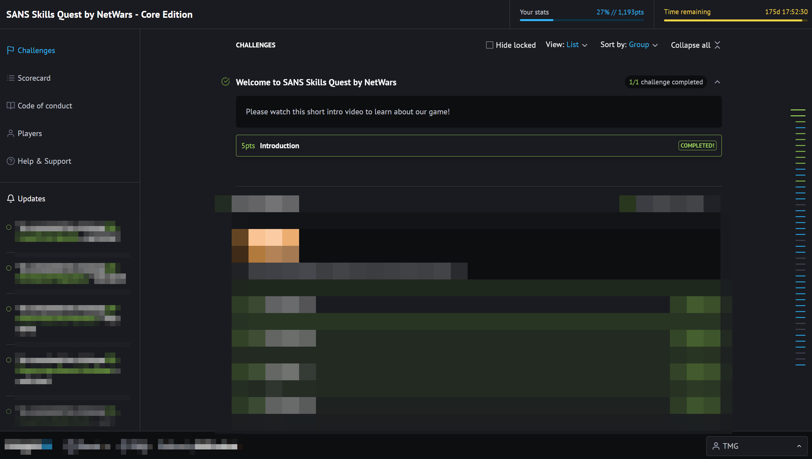

# ***🧪 Skills Quest by NetWars***

	

	<em>The training platform that actually prepares you for NetWars - not just in theory, but in practice.</em>

---
---
---

## ***⚙️ What is Skills Quest***

[Skills Quest by NetWars](https://www.sans.org/cyber-ranges/skills-quest) is the training platform built on top of the same environment used in the actual CTF.

Same infrastructure. Same challenge philosophy. Same types of scenarios.

The difference is that there's no clock running, no ranking pressure, and no six-hour window forcing you to make decisions before you're ready.

It's a space where you can:

- Move at your own pace.
- Understand how the platform actually works.
- Get familiar with the challenge types before they matter.

And that's exactly what makes it valuable.

Because the biggest problem with jumping into NetWars cold isn't skill, it's friction. You waste time figuring out the environment when you should be solving challenges.

Skills Quest removes that friction entirely.

---
---
---

## ***🎯 How I Used It***

I purchased access before the CTF, specifically the six-month subscription, and worked through it during the days leading up to the competition.

I didn't try to complete everything. That wasn't the point.

The goal was to reach a threshold of familiarity:

> Enough to know how the platform moves. Enough to recognize challenge patterns. Enough to not waste time on Day 4 figuring out the basics.

In the end, I completed roughly ~20% of the platform before the CTF started.

That was more than enough.

When the competition began, I already knew where to look, how challenges were structured, and what kind of tools and workflows to have ready.

The result was visible almost immediately, instead of spending the first hour adapting, I spent it solving.

---
---
---

## ***💡 Recommendation***

If you're planning to participate in NetWars and you have the option to access Skills Quest beforehand, use it.

You don't need to go deep. Even a few hours of practice across different challenge types will change how you experience the CTF.

> The goal isn't to train harder. It's to show up already knowing how to move.
